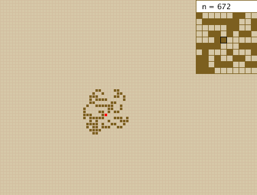
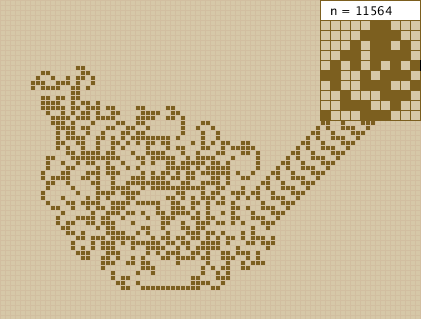

---
categories:
  - "code"
date: "2015-10-10T21:37:47+01:00"
title: "Langton's Ant in Processing"
tags:
  - "code"
  - "fun"
  - "gist"
draft: false
aliases: /code/langtons-ant-processing/
---

Just a little fun Project to check out [Processing](https://processing.org/):
Langton's Ant in Processing 3.0

Langton's Ant is interesting, very simple algorithm produces an astonishing
complex, random looking structure but may end in stable state in later cycles.

[Langton's_ant on Wikedia](https://en.wikipedia.org/wiki/Langton's_ant)


Langton's Ant on Numberphile

## Screenshots

### Round 672

In The beginning it looks right compact and random.

### Round 11564

But after a while it turns into a stable state.

## Code



## BTW


Redstone Jazz has implemented Langton's Ant within Minecraft.
